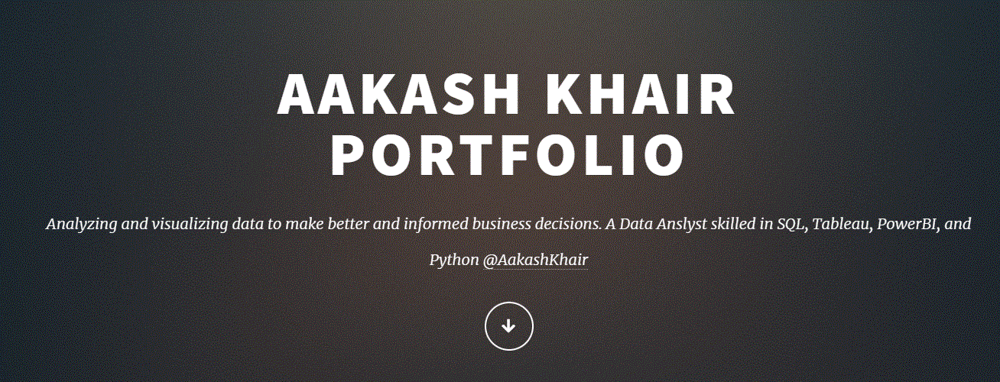

## Hi Folks!!!

I'm Aakash Khair, currently pursuing MSc. in Data Analytics 🖥️ from Dublin City University and I am passionate about learning new upcoming technologies.I have experience building scalable Machine learning models and Artificial Intelligence algorithms. Besides programming, I enjoy playing football in my free time.

### ⚡ Technologies and Skillset
- Programming 💻: Python -3, R Programming.
- ML/AI Techniques 📈: Regression, Classification, Clustering, NLP, Image Recognition.  
- Databases 🗒️: SQL server, Google Cloud SQL, Hive.
- Cloud Technologies ☁️: Google Cloud Platform.
- Tools 🔧: Familiar with RStudio, Jupyter, Tableau, Power BI, SQL Server, SSIS, GCP.

### 📫 Reach Out to me on:

